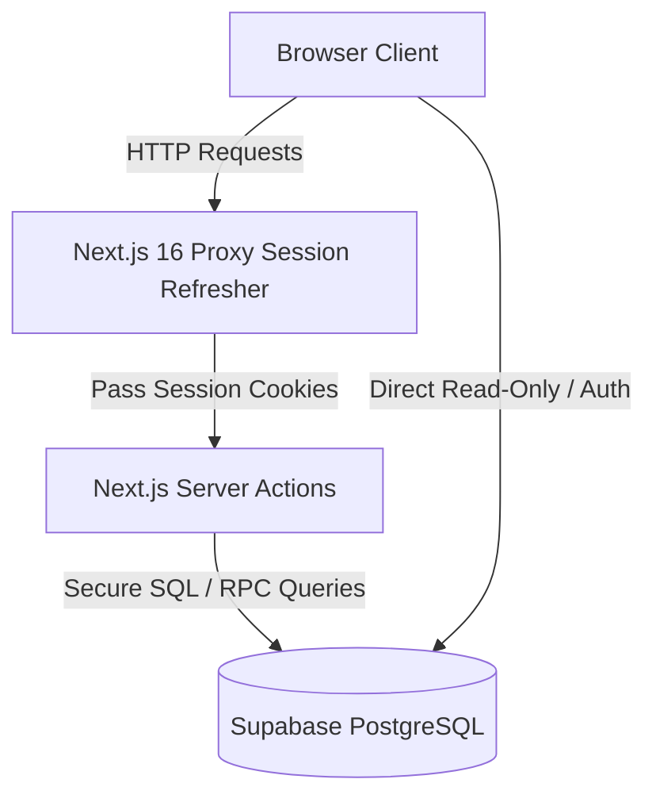
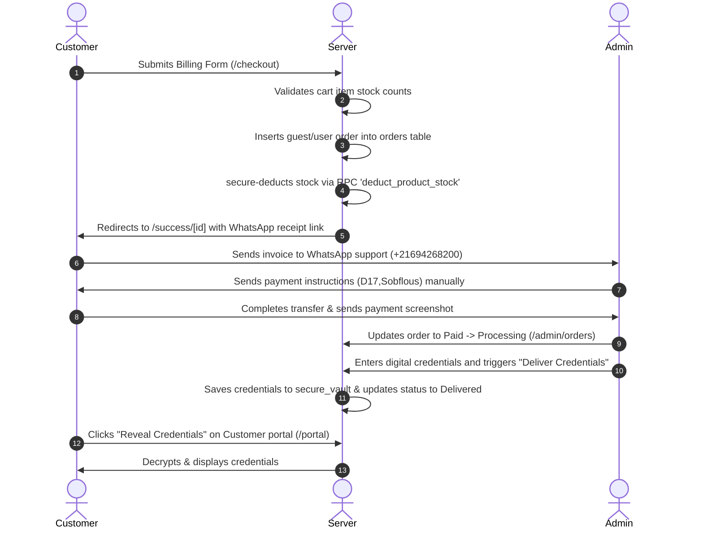

# DigitalServices4U - Complete Technical Specification & Codebase Manual

This document provides a highly detailed walkthrough of the entire **DigitalServices4U** platform codebase. It explains every single directory, file, data model, security boundary, and client-server boundary.

---

## 🏗️ 1. Architecture Overview & Design Boundaries

The project is built using **Next.js 16 (App Router)** and **React 19**, styled using **Tailwind CSS v4**, and backed by **Supabase**.

### Key Architectural Guidelines Applied:
1. **Client/Server Code Splitting**: Server-only operations (like querying cookies using `next/headers` which crashes client components) are strictly isolated in `lib/data.server.ts` and Server Actions. Pure formatting helpers and client mock objects reside in `lib/data.ts`.
2. **Next.js 16 Session Proxying**: Rather than relying on legacy `middleware.ts` configuration routes (which are deprecated or modified in Next.js 16), the project implements session refreshing inside a custom root [proxy.ts](file:///c:/Users/youse/OneDrive/Desktop/ecommerce/proxy.ts) file.
3. **Resilient Local Mock Sandbox**: If Supabase variables are unconfigured in `.env.local`, all database actions, auth screens, and dashboard views gracefully enter **Mock Mode**, loading mock state handlers to simulate successful writes, logins, and checkouts.

---

## 📂 2. File-by-File Codebase Directory Map

### 📁 Root Configuration

#### 📄 [proxy.ts](file:///c:/Users/youse/OneDrive/Desktop/ecommerce/proxy.ts)
- Next.js 16 server request interceptor.
- Protects all `/admin` routes by fetching the active session from Supabase, verifying the user's role = `'admin'` inside the public `users` table, and redirecting non-admins to `/portal` or `/login`.
- Automatically grants access locally if Supabase env credentials are not set.

#### 📄 [package.json](file:///c:/Users/youse/OneDrive/Desktop/ecommerce/package.json)
- System dependencies list. Key libraries include `next`, `react`, `react-dom`, `@supabase/ssr`, `zustand` (for client state), and `lucide-react` (for icons).

#### 📄 [tailwind.config.ts](file:///c:/Users/youse/OneDrive/Desktop/ecommerce/tailwind.config.ts)
- Custom tailwind settings configuring responsive view thresholds and font spacing overlays.

---

### 📁 App Pages Routing Layer (`/app`)

#### 📄 [layout.tsx](file:///c:/Users/youse/OneDrive/Desktop/ecommerce/app/layout.tsx)
- The global layout wrapper. Configures typography styling, binds the theme provider, fetches settings asynchronously from the server, and renders the floating `<WhatsAppWidget />` on all customer pages.

#### 📄 [page.tsx](file:///c:/Users/youse/OneDrive/Desktop/ecommerce/app/page.tsx)
- The storefront landing page. Displays the welcome hero banner, trust metrics (warranty coverage, delivery times), a grid of featured subscriptions, and a client-side search routing FAQ Accordion.

#### 📄 [globals.css](file:///c:/Users/youse/OneDrive/Desktop/ecommerce/app/globals.css)
- Tailwind CSS v4 styling hub. Defines CSS tokens for custom theme variables, custom fonts, glassmorphism card templates, and glowing pulse animations.

---

### 📁 App Pages - Catalog & Product Detail Route

#### 📁 `app/catalog`
* **📄 [page.tsx](file:///c:/Users/youse/OneDrive/Desktop/ecommerce/app/catalog/page.tsx)**: Displays the search sidebar (filtering by category checkbox, query inputs, and pricing range) next to a clean products grid showing product titles, badges, localized prices, and stock indicators. Synchronizes user filters directly to URL query strings.

#### 📁 `app/products/[id]`
* **📄 [page.tsx](file:///c:/Users/youse/OneDrive/Desktop/ecommerce/app/products/%5Bid%5D/page.tsx)**: Displays dynamic detail pages. Shows features, detailed usage guides, and a sticky pricing/stock section.
* **Metadata Generator**: Exports an async `generateMetadata` function retrieving the product's title and description to populate HTML SEO headers dynamically.

---

### 📁 App Pages - Cart & Success Route

#### 📁 `app/checkout`
* **📄 [page.tsx](file:///c:/Users/youse/OneDrive/Desktop/ecommerce/app/checkout/page.tsx)**: Displays contact/billing form fields (Full Name, Email, WhatsApp Phone, Country, Notes) beside an Order Summary showing subtotal, setup fee, and grand total.
* **Redirects**: Dispatches orders using Server Actions, empties the cart, and redirects to success receipts.

#### 📁 `app/success/[id]`
* **📄 [page.tsx](file:///c:/Users/youse/OneDrive/Desktop/ecommerce/app/success/%5Bid%5D/page.tsx)**: Order success receipt screen. Displays receipt summaries (Order UUID, customer contact details, item listing breakdown, and total prices).
* **WhatsApp Redirect CTA**: Formulates a URL-encoded link `https://wa.me/...` pre-filled with the order invoice text so customers can instantly contact support to coordinate manual payments.
* **Mock Mode Support**: Awaits URL search parameters to dynamically construct custom checkout details locally without database records.

---

### 📁 App Pages - Portal & Login Route

#### 📁 `app/login`
* **📄 [page.tsx](file:///c:/Users/youse/OneDrive/Desktop/ecommerce/app/login/page.tsx)**: Split tab authentication interface. Supports interactive client-side switching between **Log In** and **Sign Up** forms.

#### 📁 `app/portal`
* **📄 [page.tsx](file:///c:/Users/youse/OneDrive/Desktop/ecommerce/app/portal/page.tsx)**: Customer dashboard.
  * Restricts access to authenticated sessions, loading historical orders list showing price formatting and color-coded status badges.
  * **Digital Vault Display**: Queries the database for order records in a `Delivered` state and displays the credentials vault component.
  * **Payment Resumption**: Enables active payment resumption links for orders pending manual verification.
  * **Background Cron trigger**: Silent executor that invokes the auto-cancellation server action on load to ensure database updates.

---

### 📁 App Pages - Admin Workspace (`/app/admin`)

#### 📁 `app/admin`
* **📄 [layout.tsx](file:///c:/Users/youse/OneDrive/Desktop/ecommerce/app/admin/layout.tsx)**: Admin layout shell. Provides the side navigation layout (Overview metrics, Orders pipeline, Products listings, and Settings forms) and includes logout hooks.
* **📄 [page.tsx](file:///c:/Users/youse/OneDrive/Desktop/ecommerce/app/admin/page.tsx)**: Admin overview panel. Displays business metrics cards:
  1. *Delivered Revenue*: Sum of Paid/Delivered orders.
  2. *Pending Leads Value*: Value of checkouts awaiting manual payment verification.
  3. *Total Orders Leads*: Total checkouts registered.
  4. *Active Products*: Current active listing counts.

#### 📁 `app/admin/products`
* **📄 [page.tsx](file:///c:/Users/youse/OneDrive/Desktop/ecommerce/app/admin/products/page.tsx)**: Server wrapper querying inventory items and categories.
* **📄 [products-client.tsx](file:///c:/Users/youse/OneDrive/Desktop/ecommerce/app/admin/products/products-client.tsx)**: Client-side catalog grid. Supports toggle state switches for product listings visibility, and modal editing forms.

#### 📁 `app/admin/orders`
* **📄 [page.tsx](file:///c:/Users/youse/OneDrive/Desktop/ecommerce/app/admin/orders/page.tsx)**: Server-side wrapper loading the orders log.
* **📄 [orders-client.tsx](file:///c:/Users/youse/OneDrive/Desktop/ecommerce/app/admin/orders/orders-client.tsx)**: Order pipelines manager. Selecting an order opens a side panel detailing custom notes, purchased details, and status progression hooks. Marking an order as `Delivered` reveals the secure vault insertion form.

#### 📁 `app/admin/settings`
* **📄 [page.tsx](file:///c:/Users/youse/OneDrive/Desktop/ecommerce/app/admin/settings/page.tsx)**: Server wrapper querying settings.
* **📄 [settings-form.tsx](file:///c:/Users/youse/OneDrive/Desktop/ecommerce/app/admin/settings/settings-form.tsx)**: Interactive configurator to edit the marketplace name and WhatsApp hotline number.

---

### 📁 Server Actions Layer (`/actions`)

#### 📄 [order.ts](file:///c:/Users/youse/OneDrive/Desktop/ecommerce/actions/order.ts)
- Handles order submissions. Performs safety validations, verifies stock levels, calculates pricing totals on the server, inserts database rows, and deducts inventory quantities securely via SQL function.

#### 📄 [vault.ts](file:///c:/Users/youse/OneDrive/Desktop/ecommerce/actions/vault.ts)
- Query selector for digital credentials. Fetches records from the `secure_vault` table if the requesting user owns the order and its status is marked `Delivered`.

#### 📄 [auth.ts](file:///c:/Users/youse/OneDrive/Desktop/ecommerce/actions/auth.ts)
- Handles user sign-outs. Clears session cookies on the server and redirects users back to `/login`.

#### 📄 [auto-cancel.ts](file:///c:/Users/youse/OneDrive/Desktop/ecommerce/actions/auto-cancel.ts)
- Scans database records for orders left in `Pending Confirmation` or `Waiting for Payment` states for >24 hours and triggers the secure auto-cancellation database RPC.

#### 📄 [admin-products.ts](file:///c:/Users/youse/OneDrive/Desktop/ecommerce/actions/admin-products.ts)
- Administrative CRUD operations on the `products` table. Updates titles, prices, descriptions, and toggles listed active states.

#### 📄 [admin-orders.ts](file:///c:/Users/youse/OneDrive/Desktop/ecommerce/actions/admin-orders.ts)
- Controls order status lifecycles and handles credential delivery. Delivers credentials by writing to the `secure_vault` table and updating order status in a single transaction block.
- **Stock Reconciliation**: Restores product stock counts when orders transition to `Cancelled`, and deducts stock if a cancelled order is reactivated.

#### 📄 [admin-settings.ts](file:///c:/Users/youse/OneDrive/Desktop/ecommerce/actions/admin-settings.ts)
- Administrative update actions on the settings table.

---

### 📁 Library Layer (`/lib`)

#### 📄 [cart.ts](file:///c:/Users/youse/OneDrive/Desktop/ecommerce/lib/cart.ts)
- Client-side cart state manager using Zustand. Handles additions, updates, deletions, subtotal calculations, and localStorage caching. Restricts item additions against product stock limits.

#### 📄 [data.ts](file:///c:/Users/youse/OneDrive/Desktop/ecommerce/lib/data.ts)
- Pure client-safe functions. Defines mock categories, products, FAQ items, and Tunisian Dinars (TND) currency formatters.

#### 📄 [data.server.ts](file:///c:/Users/youse/OneDrive/Desktop/ecommerce/lib/data.server.ts)
- Server-side data fetchers. Implements fallback routines that query mock profiles if Supabase is unconfigured.
- Fetches active categories, products, product details, and site settings.

---

### 📁 Database Migration Schema (`/supabase`)

#### 📄 [20260612000000_init.sql](file:///c:/Users/youse/OneDrive/Desktop/ecommerce/supabase/migrations/20260612000000_init.sql)
- Database migration definitions:
  - Table schemas: `users`, `categories`, `products`, `orders`, `order_items`, `secure_vault`, and `settings`.
  - Row-Level Security (RLS) policies.
  - Setup triggers:
    1. *`on_auth_user_created`*: Listens to sign-ups and duplicates auth profiles to the public `users` table. Elevates the first registrant to admin.
    2. *`settings_single_row`*: Constraints prevent creating multiple settings rows.
  - Secure helper functions (defined with `SECURITY DEFINER` to bypass direct table writes and execute mutations on behalf of clients securely):
    1. *`deduct_product_stock(product_id, amount)`*: Securely deducts stock during checkouts.
    2. *`auto_cancel_expired_orders()`*: Scans, cancels, and restores stock for expired orders (>24 hours) atomically.

---

## 🔒 3. Row-Level Security (RLS) Configuration Matrix

The tables are locked down using PostgreSQL Row-Level Security (RLS) to enforce data boundaries:

| Table | SELECT Policy | INSERT Policy | UPDATE / DELETE Policy |
| :--- | :--- | :--- | :--- |
| **`users`** | Owner profile or Admins | Bypassed (Auth Trigger) | Owner profile or Admins |
| **`categories`**| Public Read Access | Admins Only | Admins Only |
| **`products`** | Public Read Access (Active only) | Admins Only | Admins Only |
| **`settings`** | Public Read Access | Admins Only | Admins Only |
| **`orders`** | Owner profile, Guest UUID matching, or Admins | Owner profile or Guest (`user_id IS NULL`) | Admins Only |
| **`order_items`**| Owner profile, Guest UUID matching, or Admins | Owner profile or Guest (`user_id IS NULL`) | Admins Only |
| **`secure_vault`**| Admins, or Owner profile **if** order status = `Delivered` | Admins Only | Admins Only |

---

## 🔄 4. State & Lifecycle Workflows

### Manual Payment & WhatsApp Checkout Flow

### Auto-Cancellation & Stock Recovery Flow
1. Expired check is triggered by either an API call to `/api/orders/auto-cancel?secret=...` or silently in the background on customer `/portal` visits.
2. The server action calls Supabase RPC `auto_cancel_expired_orders()`.
3. PostgreSQL queries all orders with status `Pending Confirmation` or `Waiting for Payment` created >24 hours ago.
4. For each expired order, it queries its purchased items from `order_items` and increments `products.stock_count` by those quantities.
5. Updates the order status to `Cancelled`.
6. Returns the cancelled order IDs and refreshes the cache views.
