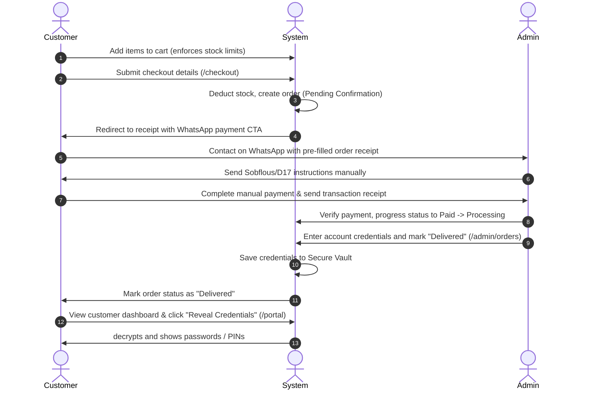

# DigitalServices4U - Premium Digital Subscription Marketplace

DigitalServices4U is a high-fidelity, production-grade SaaS-style digital subscription marketplace localized for the Tunisian market (TND). It provides an automated storefront for premium digital accounts (e.g. AI tools, streaming access, dev licenses) and leverages a custom manual workflow coordinated via WhatsApp and a secure credential delivery vault.

---

## 🚀 Key Features

### 1. Modern Premium SaaS Aesthetic
- Built with a sleek dark theme: **Dark Navy** (`#0B1220`) background, **Electric Blue** (`#2563EB`) accent highlights, glassmorphic card overlays, and smooth micro-animations.
- Interactive elements utilize hover glows, HSL tailored states, and smooth Radix/Shadcn layouts.

### 2. Public Storefront & Advanced Catalog
- **Interactive Home Page**: Features product hero grids, trust-badges, category quick links, and a dynamic interactive Accordion FAQ section.
- **Search & Filter Sidebar**: Dynamic catalog filter (`/catalog`) supporting search queries, category filters, and sliding price-bracket queries synced in real-time to URL search parameters.
- **Product Details**: Dedicated pages (`/products/[id]`) highlighting subscription inclusions, stock indicators, and instant Add-to-Cart commands.

### 3. Cart & WhatsApp Checkout Pipeline
- **Zustand Cart Store**: Client-side state drawer synced to localStorage. Restricts quantities dynamically against real-time database stock levels.
- **WhatsApp Checkout Dispatch**: Submitting a guest/registered order details form secure-deducts inventory on the server and redirects users to a custom success page (`/success/[id]`).
- **Dynamic Payment Resumption**: Generates pre-filled, URL-encoded WhatsApp messages containing ordered items and total costs, letting customers contact the store manager directly to coordinate Sobflous, D17, Bank Transfers, etc.

### 4. Customer Portal & Secure Vault Delivery
- **Secured Customer Portal**: Dashboard (`/portal`) showing order histories, real-time status badges (Pending, Waiting for Payment, Paid, Processing, Delivered, Cancelled), and payment resume triggers.
- **Secure Vault Reveal**: Delivered order records render an encrypted digital vault widget. The user can securely query and reveal passwords or PINs using dot-mask overlays (`••••••••`) and copy-to-clipboard buttons.

### 5. Unified Admin Dashboard
- **Analytics Overview**: Dashboard (`/admin`) tracking Delivered Revenue, Pending Leads Value, Total Orders count, and Active Listings count.
- **Product Listing Editor**: Fully interactive product manager supporting active listings list toggles, pricing edits, stock adjustments, and category configurations.
- **Order Pipeline & Vault Dispatcher**: Table log of checkouts. Admins can progress order states. Marking an order as `Delivered` reveals a digital credentials input that securely writes to the vault and updates order status in a single mutation.
- **Configuration Manager**: Global control sheet (`/admin/settings`) to update the store name and support WhatsApp phone number.

### 6. Automated Maintenance & SEO
- **Order Auto-Expiration**: Orders stuck in `Pending` states for >24 hours are auto-cancelled and their stock count is restored. Run via cron endpoint (`/api/orders/auto-cancel`) or silent client-side page load triggers.
- **Floating Support Icon**: Floating widget with glowing pulses, glassmorphic tooltips, and pathname rules to hide on `/admin` paths.
- **XML Sitemap & robots.txt**: Dynamic sitemap (`/sitemap.xml`) indexing catalog items, and a robots.txt file blocking crawler access to admin routes.

---

## 🛠️ Technology Stack

* **Framework**: Next.js 15/16 (App Router, dynamic routes, server components)
* **Runtime**: React 19 (Server Actions)
* **Styling**: Tailwind CSS v4 (vanilla theme overrides)
* **State Management**: Zustand (local persistent stores)
* **Backend Database**: Supabase (Auth, RLS Policies, PostgreSQL database)
* **Icons & Typo**: Lucide React, Geist Fonts

---

## 📂 Project Directory Structure

```text
├── actions/                  # Next.js Server Actions
│   ├── admin-orders.ts       # Status lifecycle & vault inserts
│   ├── admin-products.ts     # Product creation, stock updates, CRUD
│   ├── admin-settings.ts     # Site configuration mutations
│   ├── auth.ts               # Server signOut session actions
│   ├── auto-cancel.ts        # Cron auto-expiration routines
│   ├── order.ts              # Customer order placement & stock deduction
│   └── vault.ts              # Vault decryption selectors
├── app/                      # Next.js App Router Structure
│   ├── admin/                # Admin workspace layouts & pages
│   ├── api/                  # Route handlers (Cron auto-cancel)
│   ├── catalog/              # Public product catalog layout
│   ├── checkout/             # Cart checkout dispatch form
│   ├── login/                # Dual Auth Tabs (Log In / Sign Up)
│   ├── portal/               # Customer Dashboard & Vault Reveal
│   ├── products/[id]/        # Product details page
│   ├── success/[id]/         # Order success receipt & WhatsApp CTA
│   ├── globals.css           # Core v4 Tailwind utilities & colors
│   ├── layout.tsx            # Global layout shell and WhatsApp widget
│   └── page.tsx              # Marketplace Home & FAQ Page
├── components/               # Custom UI Components
│   ├── ui/                   # Reusable components (input, label, button)
│   ├── layout/               # Header, Footer, and Cart Drawer components
│   ├── add-to-cart-button.tsx
│   ├── vault-reveal.tsx      # Secure customer vault widget
│   └── whatsapp-widget.tsx   # Floating green support button
├── lib/                      # Shared helper utility files
│   ├── cart.ts               # Zustand Cart state manager
│   ├── data.ts               # Client-safe mocks & formatting helpers
│   ├── data.server.ts        # Server-only database fetch logic
│   ├── proxy.ts              # Next.js 16 Proxy Session Refresher
│   ├── utils.ts              # cn clsx twMerge resolver
│   └── supabase/             # Client & Server DB initializers
└── supabase/                 # Supabase SQL Migrations & Schema
```

---

## 🗄️ Database Schema & Security (RLS)

All SQL definitions and security rules are provisioned inside the initial migration:
`supabase/migrations/20260612000000_init.sql`

* **`users`**: Extends Supabase auth profiles, holding email, full name, and role (`customer` vs `admin`). Default trigger auto-elevates the first registrant to admin.
* **`categories`**: Digital tool divisions.
* **`products`**: Product listings, including price, stock count, and listed active states.
* **`orders` & `order_items`**: Track total prices, customer notes, telephone numbers, and line items.
* **`secure_vault`**: Stores delivered credential logs. Linked to specific orders.
* **`settings`**: Unified configuration row (`site_name`, `whatsapp_number`). Enforced by trigger limits.

### Row-Level Security (RLS) Rules:
1. **Products/Categories/Settings**: Read access is public. Write access requires authenticated users with `role = 'admin'`.
2. **Orders**: Customers can query or insert orders linked to their `user_id` (or anonymous guests can create them). Admins have complete read/write access.
3. **Secure Vault**: Credentials can only be read by the order owner *and* only if the order's status is officially marked `Delivered`. Admins can upsert credentials.

---

## ⚙️ Local Setup & Configuration

### 1. Prerequisites
- Node.js (v18+)
- npm

### 2. Environment Variables
Create a `.env.local` file in the root directory and add the following keys:
```env
NEXT_PUBLIC_SUPABASE_URL=https://your-project-id.supabase.co
NEXT_PUBLIC_SUPABASE_ANON_KEY=your-supabase-anon-key
SUPABASE_SERVICE_ROLE_KEY=your-supabase-service-role-key

# Optional: Configuration keys
NEXT_PUBLIC_SITE_URL=http://localhost:3000
CRON_SECRET=your-secret-cron-key
```

### 3. Resilient Mock Mode
If Supabase keys are not set, the platform will automatically transition to **Mock Mode**.
- Auth redirects register fake sessions.
- Operations bypass database triggers and use high-fidelity pre-seeded mock categories, products, and order activity metrics, letting you fully test store interfaces locally.

### 4. Running the Development Server
```bash
npm install
npm run dev
```
Open [http://localhost:3000](http://localhost:3000) to view the application.

### 5. Compiling a Production Build
Verify compilation, typechecking, and page optimizations:
```bash
npm run build
```

---

## 🔗 Manual Payment & Credentials Delivery Lifecycle



---

## 🛡️ License
Distributed under the MIT License. See `LICENSE` for more information.
